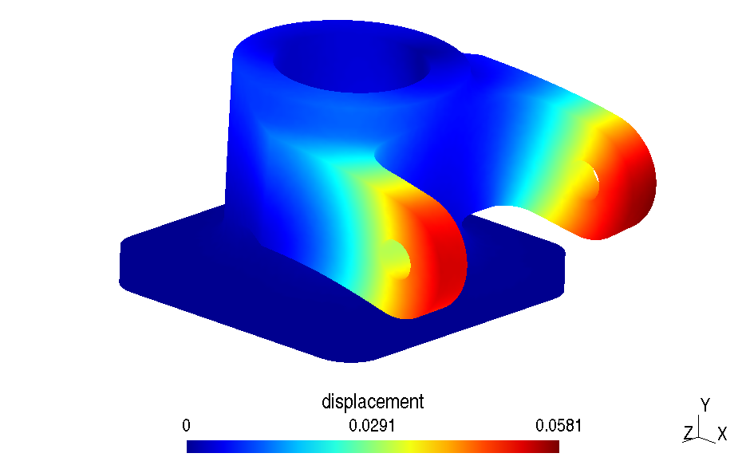

# Landing gear fork

The 3D model can be open in your browser using this [link](https://3dviewer.net#model=https://raw.githubusercontent.com/luclaurent/SILEX-light/main/calculs/landing_gear_fork/fork.step)
  
## Introduction:

*   The landing gear fork is a solid which links the airplane leg to the wheels and to the landing gear compass. The following pictures show it on 2 different legs.  
      
    

*   A detailed sketch (A3 format) is given here: [A3 SKETCH](../misc/Plan_fourche_A3.pdf)   
*   A A4 format sketch is also given here: [3D A4 SKETCH](../misc/fourch.jpg)  
*   The CAD of the solid is given with a STEP format (file [`fork.step](landing_gear_fork/fork.step)). 
*   We ask to study the solid with the following conditions:

    *   the bottom plane surface is fixed  
    *   the load from the landing gear compasses is as follow, using the (X,Y,Z) coordinates of the CAD:  
         *   [1000 N, -2000 N , 0] on one "ear",  
         *   [-5000 N, -2000 N , 0] on the other "ear".  
    *   the used material is aluminum (AU-4G), the Young's modulus is 75000 MPa, the Poisson's coefficient is 0.27 and the elastic limit is 240 MPa.  
          
## Indications for the computation:
    
* The file [`fork.step](landing_gear_fork/fork.step) is the CAD model  
* Copy the file [`piston-tet4.geo`](piston/piston-tet4.geo) into `fork-tet4.geo`, then change with your file editor (`gedit`, `notepad++` etc...) the name of the `step` file and delete the other lines        
*   Open `fork-tet4.geo` with `gmsh`:
    *   Define the volume:  `geometry/physical group/add/volume` and select the yellow ball and valid by pressing the `e` key
    *   Define the useful surfaces; for each one, do: `geometry/physical group/add/Surface` and s elect the surface(s), and valid by pressing the `e` key  
    *   Define the size of the elements: `Mesh/Define/Characteristic length /Surface`  
        * Entrer la valeur 5 dans la fenêtre de dialogue, cela correspond à la taille des éléments en mm (les longueurs sont en mm dans le fichier CAO).
        * Sélectionner dans la fenêtre graphique l'ensemble des points du modèle: appui long sur `Ctrl` puis clic gauche de la souris.
        * Tous les points doivent être rouges, valider en tapant la touche e. 
*   Copier le fichier [`Main-Piston.py`](piston/Main-Piston.py) (ou [`Main-Piston.ipynb`](piston/Main-Piston.ipynb) en  `Main-Fork.py` (ou `Main-Fork.ipynb`), modifier ce fichier puis lancer le calcul.
*   Effectuer une analyse rapide de convergence des résultats. 

## Compte-rendu  
*   Rappeler la formulation du tétraèdre à 4 nœuds. 
*    Expliquer les parties completées des programmes
*    Expliquer la programmation de l'assemblage des matrices élémentaires dans la matrice globale stockée en sparse
*    A l'aide d'un croquis, expliquer les différentes tâches réalisées en python et en fortran par le programme.
*    Analyser les deux calculs "piston" et "fourche"
*    Commenter les courbes de convergence
*    Format du compte-rendu libre: papier ou pdf, à la main ou non. 
 
## Resultats "Fourche": déplacements

## Resultats "Fourche": contraintes de Von Mises lissées

