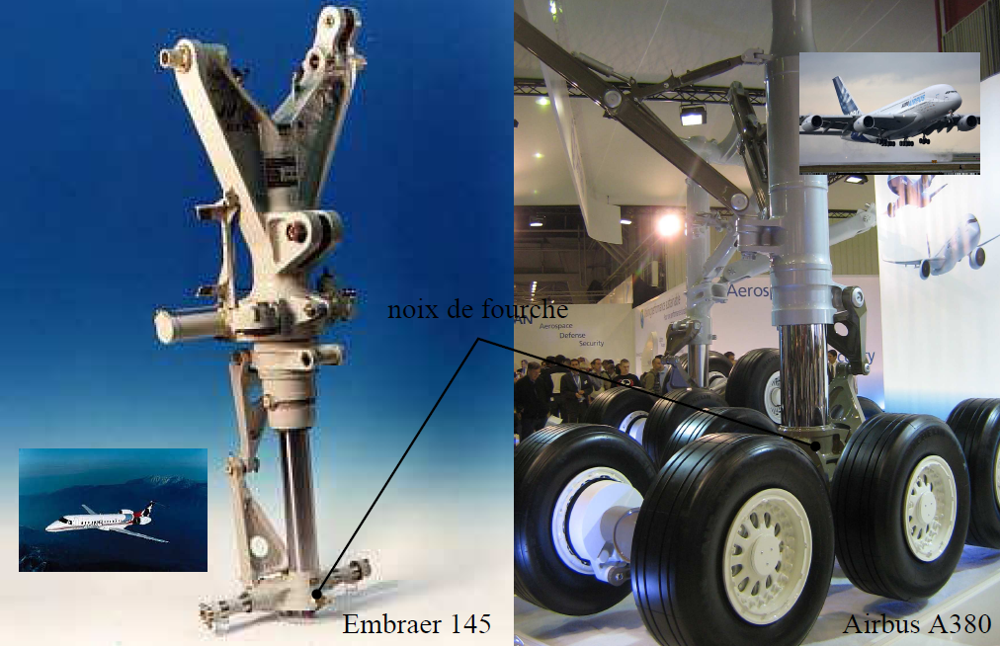
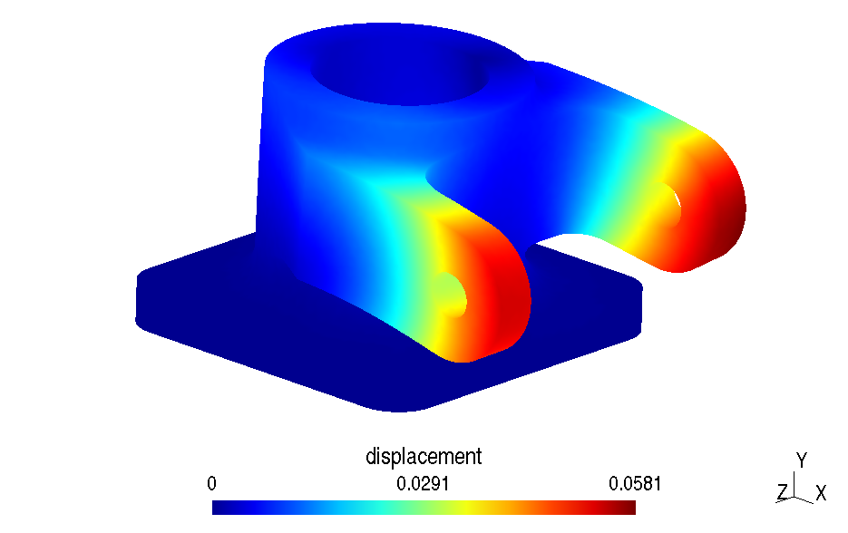
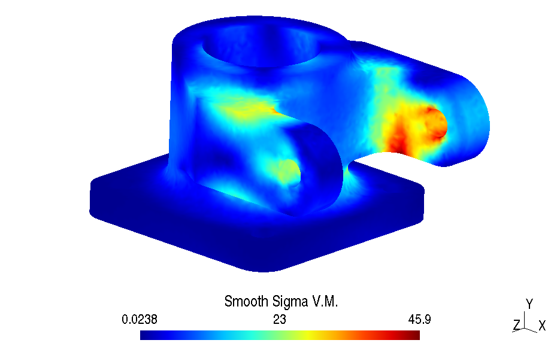

# Calcul d'une fourche de train d'atterrissage 
*English version available [here](fork_readme.md)*

Le modèle 3D du piston peut être consulté via [3Dviewer](https://3dviewer.net#model=https://raw.githubusercontent.com/luclaurent/SILEX-light/main/calculs/landing_gear_fork/fork.step)
  
## Introduction:

*   La noix de fourche étudiée est une pièce de liaison entre la jambe de train, la fourche qui supporte les roues et la branche de compas du train d'atterrissage d'un avion. Les photos suivantes montrent ces éléments sur deux jambes de train différentes.
      
    
    L'avion correspondant à la pièce étudiée n'est pas précisé. 

*   Un plan A3 d'implantation de la pièce est fourni à l'échelle 1: [PLAN A3](../misc/Plan_fourche_A3.pdf)   
*   Un plan A4 en 3 vues de la noix de fourche est aussi donné: [PLAN 3D](../misc/fourch.jpg)  
*   La CAO de la pièce est donnée au format STEP (fichier) [`fork.step`](landing_gear_fork/fork.step)). 
*   On demande de faire l'étude avec les conditions suivantes:

    *   la base de la noix de fourche est en appui plan et en liaisons pivot avec les 4 vis d'axe `y`: on peut simplifier en encastrant la face inférieure 
    *   les branches du compas exercent les efforts suivants sur les "oreilles" dans le repère (X,Y,Z) de la pièce:   
         *   [1000 N, -2000 N , 0] sur une,
         *   [-5000 N, -2000 N , 0] sur l'autre.  
    *   le matériau est de l'aluminium (AU-4G) de module d'Young 75000MPa, de coefficient de Poisson 0,27 et de limite élastique 240MPa.  
          
## Indications pour effectuer le calcul: 
    
* Le fichier [`fork.step](landing_gear_fork/fork.step) contient la géométrie volumique de la pièce.  
* Copier le fichier [`piston-tet4.geo`](piston/piston-tet4.geo) en `fourche-tet4.geo`,  puis changer avec un éditeur de texte le nom du fichier `step` et effacer toutes les autres lignes. 
*   Ouvrir `fourche-tet4.geo` avec `gmsh`:
    *   Définir le volume:   `geometry/physical group/add/volume` sélectionner la boule jaune, puis taper `e`
    *   Définir les surfaces utiles: pour chaque surface utile, faire:  `geometry/physical group/add/Surface` sélectionner la surface, puis taper `e`  
    *   Définir la taille de éléments: `Mesh/Define/Characteristic length /Surface`  
        * Entrer la valeur 5 dans la fenêtre de dialogue, cela correspond à la taille des éléments en mm (les longueurs sont en mm dans le fichier CAO).
        * Sélectionner dans la fenêtre graphique l'ensemble des points du modèle: appui long sur `Ctrl` puis clic gauche de la souris.
        * Tous les points doivent être rouges, valider en tapant la touche e. 
*   Copier le fichier [`Main-Piston.py`](piston/Main-Piston.py) (ou [`Main-Piston.ipynb`](piston/Main-Piston.ipynb) en  `Main-Fork.py` (ou `Main-Fork.ipynb`), modifier ce fichier puis lancer le calcul.
*   Effectuer une analyse rapide de convergence des résultats. 

## Compte-rendu  
*   Rappeler la formulation du tétraèdre à 4 nœuds. 
*    Expliquer les parties completées des programmes
*    Expliquer la programmation de l'assemblage des matrices élémentaires dans la matrice globale stockée en sparse
*    A l'aide d'un croquis, expliquer les différentes tâches réalisées en python et en fortran par le programme.
*    Analyser les deux calculs "piston" et "fourche"
*    Commenter les courbes de convergence
*    Format du compte-rendu libre: papier ou pdf, à la main ou non. 
 
## Resultats "Fourche": déplacements

## Resultats "Fourche": contraintes de Von Mises lissées

