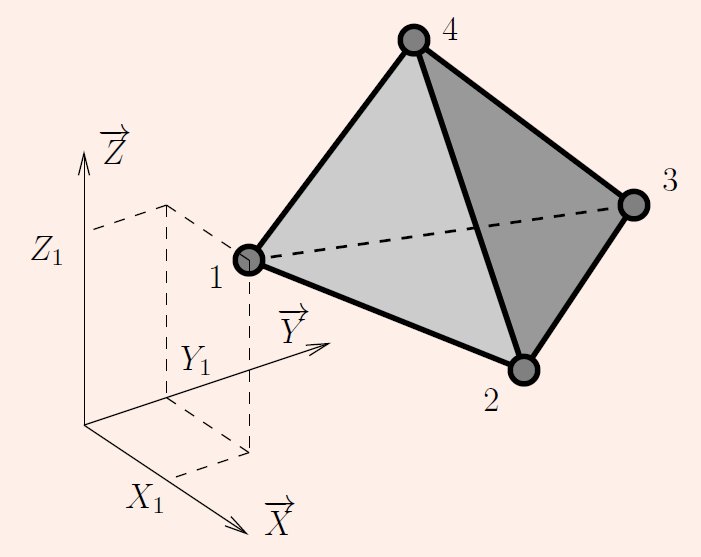
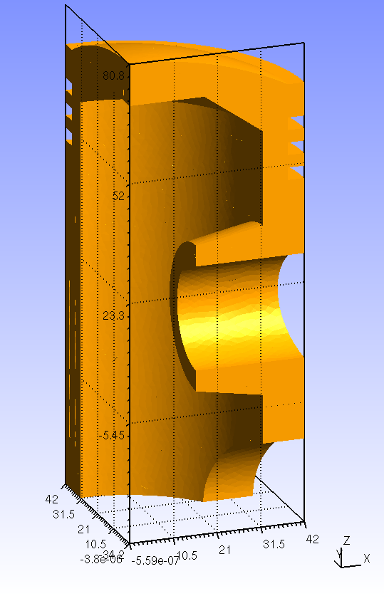
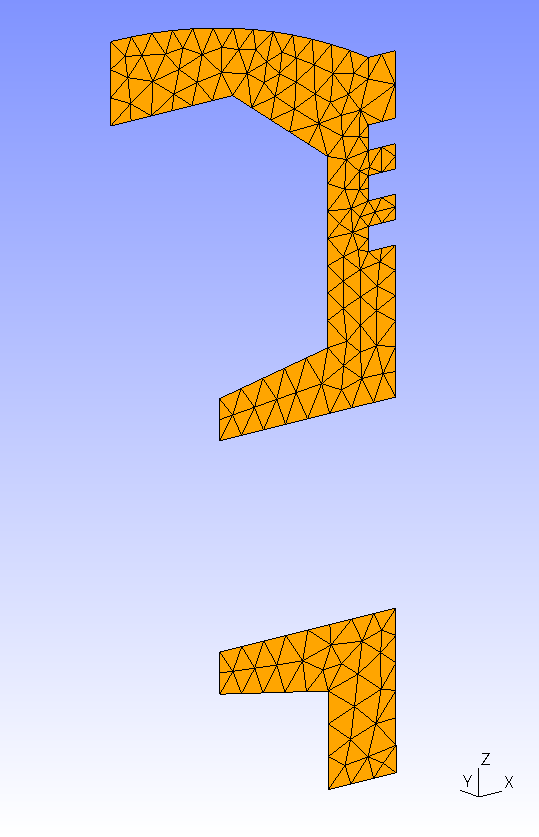
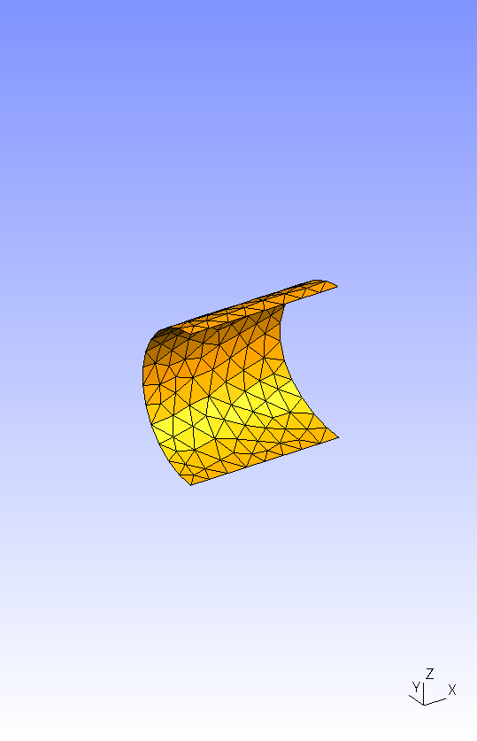
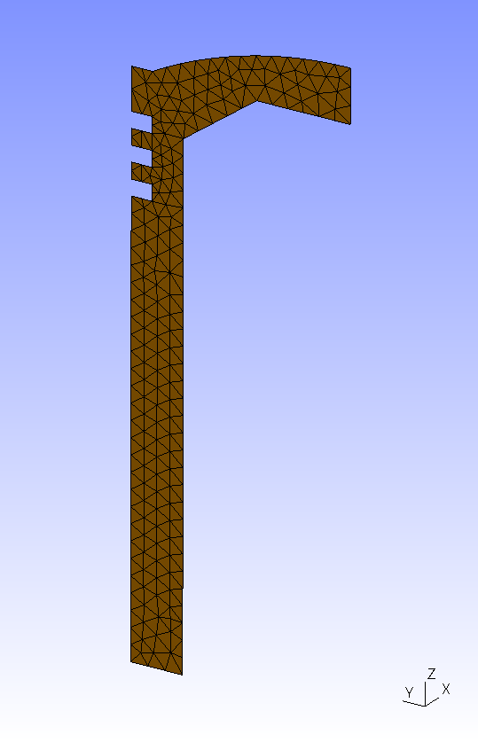
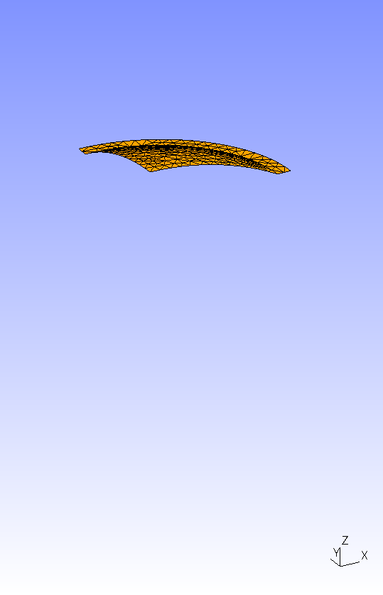
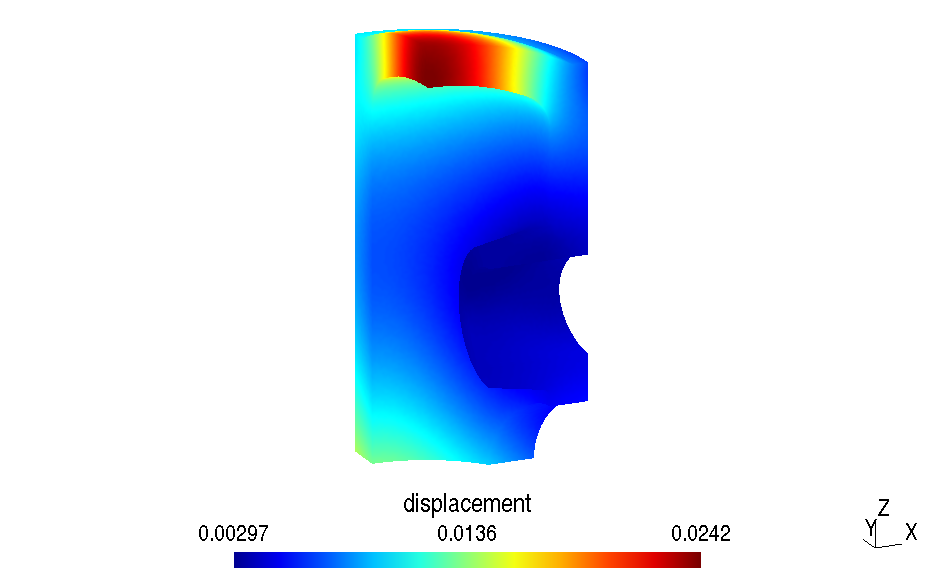
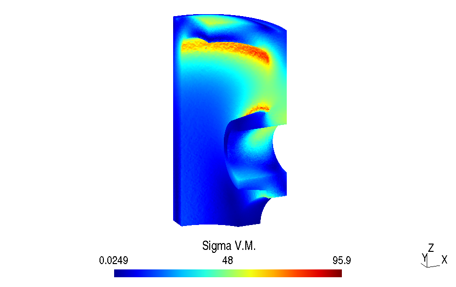
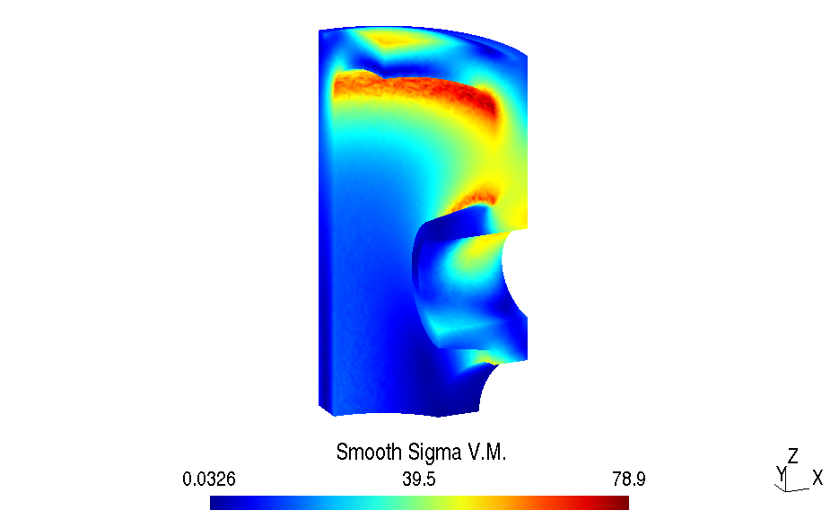
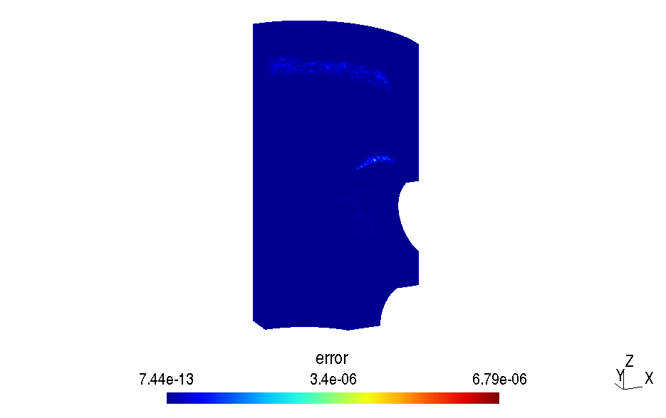

# Example of use: computation of a piston (first steps with SILEX)
*French version available [here](piston_readme.md)*
  
The 3D model can be open in your browser using this [link](https://3dviewer.net#model=https://raw.githubusercontent.com/luclaurent/SILEX-light/main/calculs/piston/piston.step)

We want to compute a 3D structure 3D meshed with 4-node tetrahedral elements.  
  

## Required files and softwares

* All the required files are located in the `calculs/piston` folder.
* A file editor is required to edit the provided files (`vim`, `gedit`, `Notepad++`, `Visual Studio Code`...)
* [`gmsh`](https://gmsh.info/) is used to mesh the structure. 

## Create the mesh with Gmsh
  
The studied solid is a piston:    
  
  
The file [`piston.step`](piston/piston.step) is a CAD file (`step` format) which has been created with a CAD software.  
The file [`piston-tet4.geo`](piston/piston-tet4.geo) is a `gmsh` text file: it loads the step file and then perform the mesh.  
  
1. Open the file [`piston-tet4.geo`](piston/piston-tet4.geo) with a file editor (`vim`, `gedit`, `Notepad++`, `Visual Studio Code`...). In the text file, the `h` variable defines the average length of the elements: change it to `h=5` in order to try the programs in the first runs.

1. Open [`piston-tet4.geo`](piston/piston-tet4.geo) with `gmsh`:

   *   With the help of the mouse, we can easily turn the solid (left button), move it (right button) or zoom it (central button).  

   *   Click on `Mesh`; `Define`; `Element size at points`: select all the points with the left click of the mouse and with holding the `Ctrl` key on: points should appear with a red color. Confirm the command by pressing the `e` key.
   *   The `physical groups` can be used to give names (numbers) to elements and nodes on which we want to apply conditions: `Geometry`; `physical group`; `add`; `surface`: select the 2 following: then press the `e` key  
      
        *   Surface S1:  
   
            

        *   Do the same for the surface S2:  
   
            

        *   Do the same for the surface S3:  
   
            

        *   Then, do the same for surface S4 (select the 1/4 of the sphere and the 1/4 of the "horizontal" ring):  
   
            
    
    *   Define the volume: click on `geometry/physical group/add/volume` and then select the small yellow ball, then confirm by pressing the `e` key.

1. Refresh the window of your file editor on which you have opened of the file `piston-tet4.geo` (click on `reload` per instance or reopen the file).  
1. Modify the numbers of the "physical groups" in this text file in order to have the correct numbers: 1, 2, 3 and 4 for the surfaces, and 5 for the volume  
1. Modify at the end of the line `Characteristic Length` the value `0.1` into `h`  
1. Save the file in the window of your file editor 
1. Go back in the `gmsh` window, and then, click on `reload`  
1. Click on `Mesh; 2D`, the surface mesh should appear (otherwise go in `tools/options/mesh/visibility` in order to change the entities you want to plot).  
1. Click on `Mesh; 3D`, the volume mesh should appear.  
2. In the `File` drop-down menu, choose `Export`, choose the format `Mesh - Gmsh (*.msh)` and then select the format `Version 2 ASCII` the mesh is saved in the file `piston-tet4.msh`. **The right mesh format must be selected in order to continue this example.**
      
**NB:** the mesh can be directly obtained by CLI using the following command (on unix systems): `gmsh -3 -format msh22 piston-tet4.geo`

## Main Python program [`Main-Piston-tet4.py`](piston/Main-Piston-tet4.py)
  
Open the file [`Main-Piston-tet4.py`](piston/Main-Piston-tet4.py) with a file editor (`idle` for instance) or open the file [`Main-Piston-tet4.ipynb`](piston/Main-Piston-tet4.ipynb) using a `jupyter` front-end.
  
### Explanations of the program:  
  

*   Part `Import libraries`:  
      
    This first part indicates to the Python the specific used libraries in this program.  
    By moving the # comment symbol, choose the elemental library:  
    *   For a full Python version (typically for Windows, at home):  

            #from SILEXlight import silex_lib_tet4_fortran as silex_lib_elt
            from SILEXlight import silex_lib_tet4_python as silex_lib_elt
        
    *   For a compiled Fortran library (typically for Ubuntu, at the university):  

            from SILEXlight import silex_lib_tet4_fortran as silex_lib_elt
            #from SILEXlight import silex_lib_tet4_python as silex_lib_elt
    
*   Part `USER PART: Import mesh, boundary conditions and material`:  
      
    *   The variable `MeshFileName` gives the name of the mesh file coming from Gmsh (with no `.msh` extension).        
    *   The variable `ResultsFileName` gives the name of the result file (Gmsh format) in which the selected results are written (with no `.msh` extension).
    *   The variable `eltype` gives the element type used in the program: 4 for 4-node tetrahedral. Other types of elements are possible, see the [`silex_lib_gmsh.py`](../SILEXlight/silex_lib_gmsh.py) library to have the full list.
    *   The variable `ndim` gives the dimension of the geometry: 2 for 2D, 3 for 3D.
    *   The variable `flag_write_fields` gives the type of results that are saved in the result file:
        
        *   1 for all fields,
        *   0 for a "short" output.
        *   Other values can be defined by the user at the end of this file [`Main-Piston-tet4.py`](piston/Main-piston-tet4.py).
        
    *   The routine `ReadGmshNodes` of the library `silex_lib_gmsh` is used to import node coordinates from the mesh file in the table `nodes`.  
          
        Use:  `nodes=silex_lib_gmsh.ReadGmshNodes('mymesh.msh', 2 ou 3)`
        
    *   The routine `ReadGmshElements` of the library `silex_lib_gmsh` is used to import the connectivity table from the mesh file in the table `elements`, the corresponding node numbers are in the table `Idnodes`.  
          
        Use: `elements,Idnodes=silex_lib_gmsh.ReadGmshElements('mymesh.msh',element_type,physical_group)`
        
    *   As soon as the volume mesh is imported, we use the routine `ReadGmshElements` in order to import the 3-node triangle surface meshes (type of element 2) of the important surfaces of the computation: `elementsS1` to `elementsS4` and `IdnodeS1` to `IdnodeS4`.  
        
    *   In order to check if the meshes are correctly read and imported, we can write them in Gmsh format files with the help of the `WriteResults` routine of from library `silex_lib_gmsh`.  
          
        Use: `silex_lib_gmsh.WriteResults('checkmesh.msh',nodes,elements,element_type)`
        
    *   The variable `Young` gives the Young's modulus, here 200000 MPa for steel.  

    *   The variable `nu` gives the Poisson's coefficient, here 0.3 for steel.  

    *   The fixed nodes in `x` direction are given in the table `IdNodesFixed_x` (here `IdnodeS3`)  

    *   The fixed nodes in `y` direction are given in the table `IdNodesFixed_y` (here `IdnodeS1`)  

    *   The fixed nodes in `z` direction are given in the table `IdNodesFixed_z` (here `IdnodeS2`).  

    *   We use in the program the following numbering:
        *   Local numbering: `Local numbering of the dofs in an element`
            
            |Name of the unknowns|Python numbering|Fortran numbering|
            |---|---|---|
            |Ux1|0|1|
            |Uy1|1|2|
            |Uz1|2|3|
            |Ux2|3|4|
            |Uy2|4|5|
            |Uz2|5|6|
            |Ux3|6|7|
            |Uy3|7|8|
            |Uz3|8|9|
            |Ux4|9|10|
            |Uy4|10|11|
            |Uz4|11|12|
            
        *   Global numbering: `Global numbering of the dofs`
            
            |Name of the unknown|Python numbering|Fortran numbering|
            |---|---|---|
            |Ux1|0|1|
            |Uy1|1|2|
            |Uz1|2|3|
            |Ux2|3|4|
            |Uy2|4|5|
            |Uz2|5|6|
            |....|....|....|
            |Uxi|(i-1)*3|(i-1)*3+1|
            |Uyi|(i-1)*3+1|(i-1)*3+2|
            |Uzi|(i-1)*3+2|(i-1)*3+3|
            |....|....|....|
            |Uxn|(n-1)*3|(n-1)*3+1|
            |Uyn|(n-1)*3+1|(n-1)*3+2|
            |Uzn|(n-1)*3+2|(n-1)*3+3|
            
  
            
    *   The upper face of the piston is loaded under a pressure of 10MPa (100bar). The triangle elements from this surface are in the table `elementsS4`.  
        The routine `forceonsurface` of the library `silex_lib_tet4` (renamed into `silex_lib_elt`) allow to compute the forces on the nodes for a given surface force with the norm `press` in the direction `direction`:  
          
        Use: `F = silex_lib_elt.forceonsurface(nodes, <surface_elements_where_the_load_is_applied>, press, direction)`
          
        If the given direction is `[0.0,0.0,0.0]`, then the local unit normal to the surface is used, it is the case for a surface pressure load. In this case, the normal is computed from the local numbering in the elements, so check if the load is correctly applied. If it is in the wrong direction, just change the sign of the pressure value.  
          
        
*   `EXPERT` part  
      
    *   `nnodes` : number of nodes.  
    *   `ndof` : number of degrees of freedom (dofs).  
    *   `nelem` : number of elements.  
    *   `Fixed_Dofs` : fixed dofs.  
    *   `SolvedDofs` : free dofs.  
    *   `Q` : nodal displacements.  
    *   Compute the stiffness matrix and sparse format assembly:  

            Ik,Jk,Vk=silex_lib_elt.stiffnessmatrix(nodes, elements, [Young,nu])  
            K=scipy.sparse.csc_matrix( (Vk,(Ik,Jk)), shape=(ndof,ndof), dtype=float)
        
          
          
        
    *   Solve the system (note that we assume the the imposed displacements are zero, otherwise, it has to be modified):  
          
            Q[SolvedDofs] = scipy.sparse.linalg.spsolve(K[SolvedDofs, :][:, SolvedDofs], F[SolvedDofs])
        
    *   Compute:
        
        *   the stresses (in the elements as well as the nodal smooth stress)
        *   the strain (in the elements as well as the nodal smooth stress)
        *   the elemental contributions to the global error
        *   the global energy error (ZZ1)
        
                SigmaElem, SigmaNodes, EpsilonElem, EpsilonNodes, ErrorElem, ErrorGlobal = silex_lib_elt.compute_stress_strain_error(nodes, elements, [Young,nu], Q)
        
    *   `disp` : table of the displacements of the nodes written using 3 columns (or 2 for a 2D plane computation) for the Gmsh format output.  
          
        
    *   `load` : given and imposed forces on the nodes written using 3 columns (or 2 for a 2D plane computation) for the Gmsh format output.  
          
        
    *   `fields_to_write` : Python list of the fields to save in the result file. See the routine `WriteResults` of the library `silex_lib_gmsh` for more details.  
 

Results "Piston": displacements for `h=0.8`
-------------------------------------------
  

Results "Piston": Von Mises stress in the elements for `h=0.8`
--------------------------------------------------------------
  

Results "Piston": smooth Von Mises stress at the nodes for `h=0.8`
------------------------------------------------------------------
  

Results "Piston": elemental contribution to the global error for `h=0.8`
------------------------------------------------------------------------

  

Exercise: convergence study for the piston case
------------------------------------------------------------------------

* Decrease the average size of the elements, for instance h=5, h=3, h=1 and save the results in different files. Decrease until you reach the memory limit of the computer.
* For each computation: get the computational time, get the number of nodes, get the number of elements and then compare the results.
* Use the file `plot_convergence.py` in order to plot the following curves:
  * Plot the displacement in terms of number of nodes
  * Plot the maximum Von Mises stress (smoothed and not smoothed) in terms of number of nodes
  * Plot the global error in terms of the average size of the elements (use log-log scale)
  * Plot the computational time in terms of number of node (use log-log scale). 