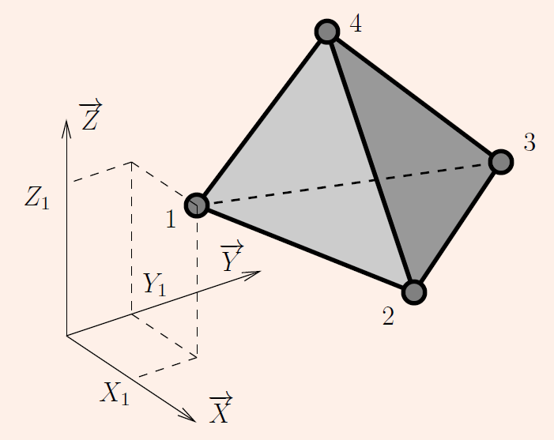
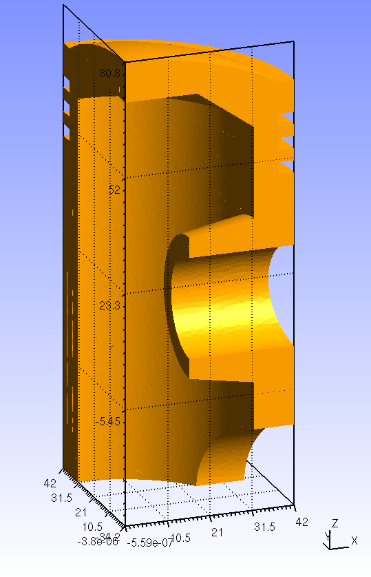
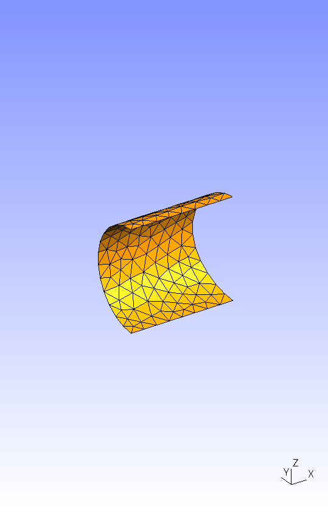
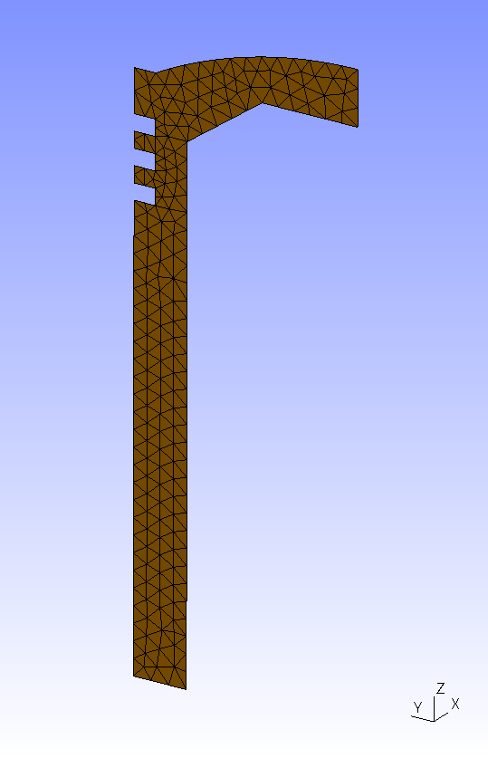
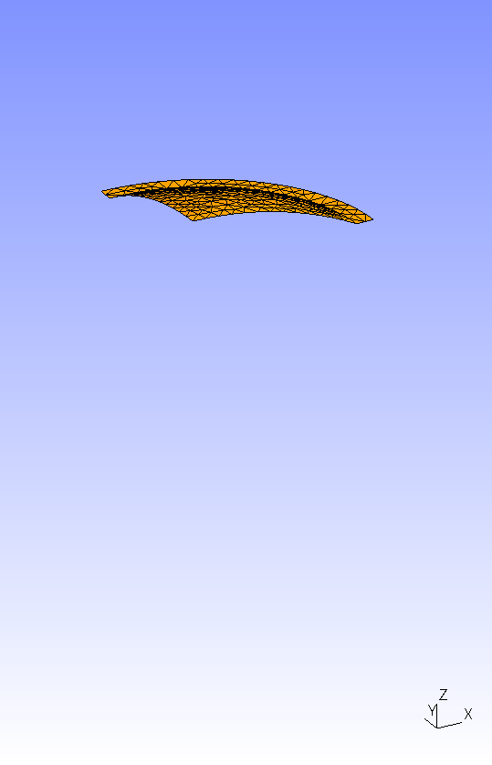
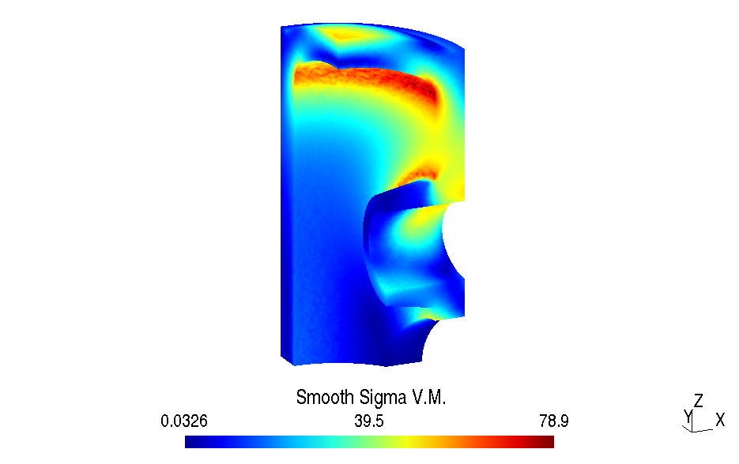
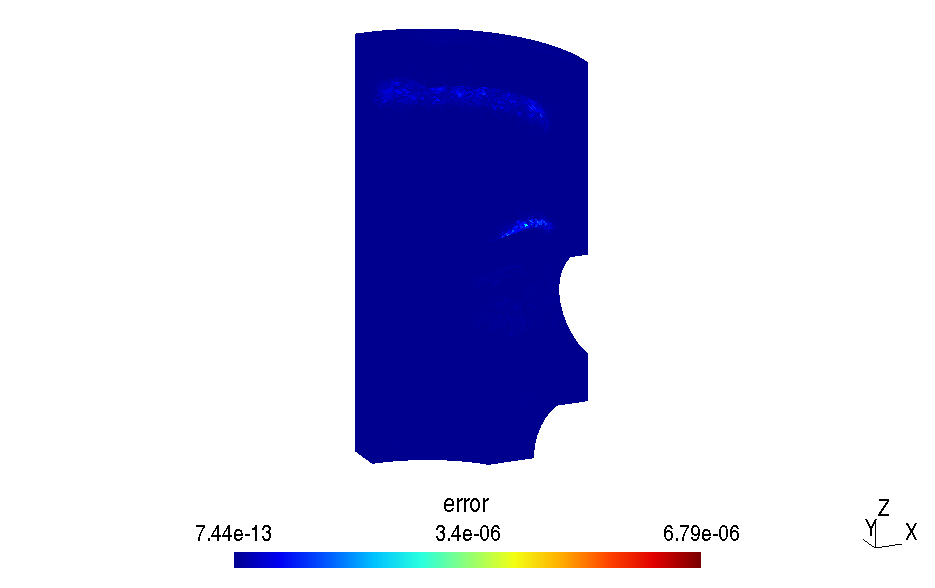

# Exemple d'utilisation: calcul d'un piston (premier pas avec)
*English version available [here](piston_readme.md)*
  
Le modèle 3D du piston peut être consulté via [3Dviewer](https://3dviewer.net#model=https://raw.githubusercontent.com/luclaurent/SILEX-light/main/calculs/piston/piston.step)

On souhaite calculer une structure 3D consituée de tétraèdres à 4 nœuds. 
  

## Fichiers et logiciels nécessaires

* Tous les fichiers nécessaires sont disponibles dans le dossier `calculs/piston`.
* Un éditeur de fichier (`vim`, `gedit`, `Notepad++`, `Visual Studio Code`...) afin d'éditer les fichiers fournis
* [`gmsh`](https://gmsh.info/) est utilisé pour assurer le maillage. 

## Maillage avec Gmsh 
  
La pièce étudiée est un piston:
  

Le fichier [`piston.step`](piston/piston.step) contient la géométrie au format step issue d'un logiciel de CAO. 
Le fichier [`piston-tet4.geo`](piston/piston-tet4.geo) est écrit au format gmsh. 

  
1. Ouvrir le fichier [`piston-tet4.geo`](piston/piston-tet4.geo) avec un éditeur de fichier (`vim`, `gedit`, `Notepad++`, `Visual Studio Code`...) et aussi avec gmsh. La variable `h` définie la taille des éléments. Changer la taille de maille `h` pour mettre `h=5` pour tester les programmes. 

3. Ouvrir [`piston-tet4.geo`](piston/piston-tet4.geo) avec `gmsh`:

   *   A l'aide de la souris, on peut de façon très simple faire tourner le modèle (clic gauche), le déplacer (clic droit) ou faire des zooms (bouton central). 

   *   Cliquer sur `Mesh; Define; Element size at points`: sélectionner tous les points avec le bouton gauche de la souris en laissant la touche `Ctrl` enfoncée: les points doivent apparaitrent en rouge. Valider en tapant `e`. 
   *   Les `physical groups` ffectent des noms aux éléments et aux nœuds pour pouvoir ensuite leur appliquer des conditions: `Geometry`; `physical group`; `add`; `surface`: sélectionner les 2 surfaces suivantes: puis taper `e`.  
      
        *   Surface S1:  
   
             

        *   Faire de même avec pour la surface S2:  

             

        *   Puis pour la surface S3:  

             

        *   Enfin pour la surface S4 (cliquer sur le 1/4 de sphère et sur le 1/4 d'anneau "horizontal"):

             
    
    *   Définir le volume: cliquer sur  `geometry/physical group/add/volume` et sélectionner la boule jaune, puis taper `e`.

4. Rafraichir la fenêtre de votre éditeur de fichier dans laquelle est ouvert le fichier `piston-tet4.geo` (cliquer sur `Rafraichir` ou rouvrir le fichier).  
5. Modifier les numéros des "physical groups" du fichier texte `Piston.geo` pour avoir les numéros corrects: 1, 2, 3 et 4 pour les surfaces, et 5 pour le volume.
6. Modifier aussi à la fin de `Characteristic Length` le  `0.1` en 
7. Sauvegarder votre fichier dans l'éditeur de fichier.
8. Retourner dans la fenêtre `gmsh` puis cliquer sur `reload`  
9. Cliquer sur `Mesh; 2D`, le maillage surfacique doit apparaitre (sinon aller dans `tools/options/mesh/visibility` pour changer les entités affichées). 
10. Cliquer sur `Mesh; 3D`,  le maillage volumique doit apparaitre. 
11. Dans le menu déroulant File, choisir Export, puis le format `Mesh - Gmsh (*.msh`), et enfin `Version 2 ASCII` dans le menu déroulant. Le maillage est ainsi sauvegardé dans le fichier `piston-tet4.msh`. **Le choix d'une mauvaise version de maillage ne permettra pas de poursuivre l'exemple.**
      
**NB:** le maillage peut également être obtenu via la commande (sur machine UNIX/Linux): `gmsh -3 -format msh22 piston-tet4.geo`

## Programme Python [`Main-Piston-tet4.py`](piston/Main-Piston-tet4.py)
  
Ouvrir le fichier [`Main-Piston-tet4.py`](piston/Main-Piston-tet4.py) avec un éditeur de fichier (`idle` recommandé) ou ouvrir le fichier [`Main-Piston-tet4.ipynb`](piston/Main-Piston-tet4.ipynb) dans une instance `jupyter`.
  
### Explications du programme en Python:  
  

*   Partie `Import libraries`:  
      
    Cette première partie indique à python les librairies spécifiques que l'on va utiliser.
    En déplaçant le `#` du commentaire, choisir la librairie de calcul au niveau élémentaire:  
    *   Pour une version Python (typiquement pour Windows): 

            #from SILEXlight import silex_lib_tet4_fortran as silex_lib_elt
            from SILEXlight import silex_lib_tet4_python as silex_lib_elt
        
    *   Pour une version avec une librairie Fortran compilée:   

            from SILEXlight import silex_lib_tet4_fortran as silex_lib_elt
            #from SILEXlight import silex_lib_tet4_python as silex_lib_elt
    
*   Partie `USER PART: Import mesh, boundary conditions and material`:  
      
    *   La variable  `MeshFileName` indique le nom du fichier maillage de provenant de gmsh (sans l'extension `.msh`).        
    *   La variable `ResultsFileName` indique le nom du fichier dans lequel les résultats sont écrits (sans l'extension `.msh`).
    *   La variable `eltype` ndique le type d'éléments que l'on utilise: 4 pour les tétraèdres à 4 nœuds. Les autres types d'éléments sont détaillés dans la librairie [`silex_lib_gmsh.py`](../SILEXlight/silex_lib_gmsh.py)
    *   La variable `ndim` ndique la dimension de la géométrie: 2 pour 2D, 3 pour 3D.
    *   La variable `flag_write_fields` indique le type de résultats que l'on souhaite écrire dans le fichier résultat:
        
        *   1 pour tous les champs,
        *   0 pour une sortie courte,
        *   D'autres valeurs peuvent être définies à la fin du fichier [`Main-Piston-tet4.py`](piston/Main-piston-tet4.py).
        
    *   La routine `ReadGmshNodes` de la librairie `silex_lib_gmsh` permet d'importer les coordonnées des nœuds depuis le fichier de maillage dans le tableau `nodes`.  
          
        Utilisation:  `nodes=silex_lib_gmsh.ReadGmshNodes('mymesh.msh', 2 ou 3)`
        
    *   La routine `ReadGmshElements` de la librairie `silex_lib_gmsh` ermet d'importer la table de connectivité des éléments depuis le fichier de maillage dans le tableau `elements`, les numéros des nœuds correspondants sont stockés dans le tableau `Idnodes`.  
          
        Utilisation: `elements,Idnodes=silex_lib_gmsh.ReadGmshElements('mymesh.msh',element_type,physical_group)`
        
    *   Une fois le maillage volume importé, on utilise la routine `ReadGmshElements` pour importer les maillages surfaciques de triangles à 3 nœuds (type d'élément 2) des surfaces fonctionnelles du calcul:  `elementsS1` à `elementsS4` et `IdnodeS1` à `IdnodeS4`.  
        
    *   Afin de vérifier si les maillages sont bien importés, on peut les écrire dans un fichier au format gmsh à l'aide de la routine `WriteResults` routine de la librairie `silex_lib_gmsh`.  
          
        Utilisation: `silex_lib_gmsh.WriteResults('checkmesh.msh',nodes,elements,element_type)`
        
    *   La variable `Young` indique le module d'Young, ici 200000 MPa pour de l'acier. 

    *   La variable `nu` ndique le coefficient de Poisson, ici 0.3 pour de l'acier. 
    *   Les noeuds bloqués dans la direction `x` sont indiqués dans le tableau `IdNodesFixed_x` (ici `IdnodeS3`), ceux bloqués dans la direction `y` dans le tableau `IdNodesFixed_y` (ici `IdnodeS1`), enfin ceux bloqués dans la direction z dans le tableau `IdNodesFixed_z` (ici `IdnodeS2`).  

    *   On utilise dans le programme les numérotations suivantes: 
        *   Numérotation locale:  `Numérotation des ddls au niveau local`
            
            |Noms des inconnues|Indexage Python|Indexage Fortran|
            |---|---|---|
            |Ux1|0|1|
            |Uy1|1|2|
            |Uz1|2|3|
            |Ux2|3|4|
            |Uy2|4|5|
            |Uz2|5|6|
            |Ux3|6|7|
            |Uy3|7|8|
            |Uz3|8|9|
            |Ux4|9|10|
            |Uy4|10|11|
            |Uz4|11|12|
            
        *   Numérotation globale: `Numérotation des ddls au niveau global`
            
            |Noms des inconnues|Indexage Python|Indexage Fortran|
            |---|---|---|
            |Ux1|0|1|
            |Uy1|1|2|
            |Uz1|2|3|
            |Ux2|3|4|
            |Uy2|4|5|
            |Uz2|5|6|
            |....|....|....|
            |Uxi|(i-1)*3|(i-1)*3+1|
            |Uyi|(i-1)*3+1|(i-1)*3+2|
            |Uzi|(i-1)*3+2|(i-1)*3+3|
            |....|....|....|
            |Uxn|(n-1)*3|(n-1)*3+1|
            |Uyn|(n-1)*3+1|(n-1)*3+2|
            |Uzn|(n-1)*3+2|(n-1)*3+3|
            
  
            
    *   La face supérieure est soumise à une pression de 10MPa (100bar). Les éléments triangles constituants cette surface sont dans le tableau `elementsS4`.  
        La routine `forceonsurface` de la librairie `silex_lib_tet4` (renommée `silex_lib_elt`)ermet de calculer les forces aux nœuds dues à une force surfacique de norme `press` dans la direction `direction`:  
          
        Utilisation: `F = silex_lib_elt.forceonsurface(nodes, <surface_elements_where_the_load_is_applied>, press, direction)`
          
        Si la direction vaut `[0.0,0.0,0.0]`, alors c'est la normale locale à la surface qui est utilisée, c'est le cas pour une force surfacique due à une pression. Dans ce cas la direction de la normale étant calculée à partir de la numérotation locale des nœuds, elle peut être en sens opposé, il suffit de changer le signe de press pour obtenir une force dans la bonne direction. 
          
        
*   Partie `EXPERT`  
      
    *   `nnodes` : nombre de nœuds.   
    *   `ndof` : nombre de degrés de liberté. 
    *   `nelem` : nombre d'éléments.  
    *   `Fixed_Dofs` : ddl bloqués. 
    *   `SolvedDofs` : ddl libres à calculer.  
    *   `Q` : déplacements aux nœuds. 
    *   Calcul de la matrice de rigidité et assemblage au format sparse:

            Ik,Jk,Vk=silex_lib_elt.stiffnessmatrix(nodes, elements, [Young,nu])  
            K=scipy.sparse.csc_matrix( (Vk,(Ik,Jk)), shape=(ndof,ndof), dtype=float)
        
    *   Résolution du système en déplacement (on suppose que les déplacements imposés sont nuls, à modifier dans le cas contraire):  
          
            Q[SolvedDofs] = scipy.sparse.linalg.spsolve(K[SolvedDofs, :][:, SolvedDofs], F[SolvedDofs])
        
    *   Calcul des contraintes `SigmaElem` et `SigmaNodes` (dans les éléments et lissées aux nœuds), des déformations `EpsilonElem` et  `EpsilonNodes` (dans les éléments et lissées aux nœuds), des contributions des éléments à l'erreur `ErrorElem`, et enfin de l'erreur en énergie ZZ1 `ErrorGlobal`:

                SigmaElem, SigmaNodes, EpsilonElem, EpsilonNodes, ErrorElem, ErrorGlobal = silex_lib_elt.compute_stress_strain_error(nodes, elements, [Young,nu], Q)
        
      

        
    *   `disp` : déplacements des nœuds écrit sur 3 colonnes (ou 2 en 2D) pour la sortie au format gmsh. 
    *   `load` : efforts imposés aux nœuds écrit sur 3 colonnes (ou 2 en 2D) pour la sortie au format gmsh. 
    *   `fields_to_write` : liste python des champs à écrire dans le fichier résultat. Voir routine `WriteResults` de la librairie `silex_lib_gmsh` pour plus de détails. 
 

Resultats "Piston": déplacements pour `h=0.8`
-------------------------------------------
  

Resultats "Piston": contraintes dans les éléments pour `h=0.8`
--------------------------------------------------------------
  

Resultats "Piston": contraintes lissées pour `h=0.8`
------------------------------------------------------------------
  

Resultats "Piston": erreurs dans les éléments pour `h=0.8`
------------------------------------------------------------------------

  

Exercice: étude de convergence
------------------------------------------------------------------------

* Diminuer la taille des éléments en effectuant plusieurs calculs, par exemple `h=5`, `h=3`, `h=1` et en changeant le nom du fichier de résultats. Diminuer la taille jusqu'à la limite mémoire de l'ordinateur.
* Noter les temps de calcul, le nombre de nœuds et le nombre d'éléments, puis comparer les résultats
* Utiliser le fichier `plot_convergence.py` pour tracer les courbes suivantes:

  * Tracer l'évolution du déplacement en fonction du nombre de noeuds
  * Tracer l'évolution de la contrainte de Von Mises maximum, non lissée et lissée en fonction du nombre de nœuds
  * Tracer l'évolution de l'erreur globale en fonction de la taille des éléments (échelle log-log)
  * Tracer l'évolution du temps de calcul en fonction du nombre de nœuds (échelle log-log). 